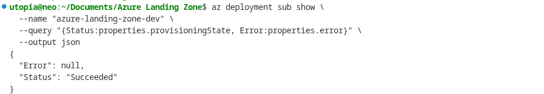

# Deployment Guide

This guide walks through every step of deploying the Azure Landing Zone, from
logging in to verifying resources and cleaning up. Each step is explained so that someone
new to Azure can follow along confidently.

If something goes wrong at any step, the error messages from Azure CLI are usually descriptive
enough to point us in the right direction. When in doubt, re-run the validation step (Step 4)
before attempting a full deployment.

---

## Prerequisites

Before we begin, make sure the following tools are installed and ready on the local machine.

| Tool | Why we need it | How to check |
|------|---------------|--------------|
| **Azure CLI** | Deploys and manages all Azure resources from the command line | `az --version` |
| **Bicep CLI** | Compiles our `.bicep` files into ARM templates. It ships bundled with Azure CLI, so there is nothing extra to install. | `az bicep version` |
| **Azure subscription** | The actual Azure account where resources will be created. We need **Owner** or **Contributor** role on the subscription. | `az account show` |
| **PowerShell 7+** | Required only for the operational scripts (NSG audit, VM scheduling). Not needed for the core deployment itself. | `pwsh --version` |

If Azure CLI is not installed yet, follow the official guide:
[Install the Azure CLI](https://learn.microsoft.com/en-us/cli/azure/install-azure-cli).

---

## Step 1: Login and Set Subscription

First, authenticate with Azure. This opens a browser window where we sign in with our
Microsoft account.

```bash
az login
```

After logging in, verify that the correct subscription is active:

```bash
az account show
```

The output shows the subscription name, ID, and tenant. If we have multiple subscriptions and
need to switch, use:

```bash
az account set --subscription "<subscription-name-or-id>"
```

**Why this matters:** Every Azure CLI command runs against the "active" subscription. If we
deploy to the wrong subscription, we will create resources in the wrong place and potentially
incur unexpected costs.

---

## Step 2: Set Environment Variable

Our Bicep templates use the `readEnvironmentVariable()` function to read the jumpbox VM's
admin password from an environment variable. This approach keeps secrets out of parameter files
and out of version control.

**What is `readEnvironmentVariable()`?** It is a built-in Bicep function that reads a value
from the shell environment at deployment time. Instead of hardcoding a password in a
`.bicepparam` file (which would be checked into Git), we store it in an environment variable
that only exists in our current terminal session.

Set the password:

```bash
export JUMPBOX_ADMIN_PASSWORD='YourStrongPassword123!'
```

The password must meet Azure's complexity requirements:

- At least 12 characters
- Contains uppercase, lowercase, numbers, and a special character
- Does not contain the username

**Making it permanent (optional):** If we want the variable to persist across terminal
sessions, add the export line to `~/.bashrc` (or `~/.zshrc` for Zsh):

```bash
echo "export JUMPBOX_ADMIN_PASSWORD='YourStrongPassword123!'" >> ~/.bashrc
source ~/.bashrc
```

> **Security note:** Storing passwords in shell profile files is acceptable for
> dev/lab environments, but for production, consider using Azure Key Vault references
> or a secrets manager instead.

---

## Step 3: Validate Locally

Before talking to Azure at all, we can lint and build the Bicep files locally. This catches
syntax errors, typos, and linter warnings without making any API calls.

```bash
bash scripts/bash/validate-bicep.sh
```

This script runs two things:

1. **`az bicep lint`** -- checks for style issues and best-practice violations
2. **`az bicep build`** -- compiles each `.bicep` file into an ARM JSON template to verify it is syntactically correct

If the script exits with no errors, our Bicep code is structurally sound. If it reports
warnings, they are worth reviewing but will not block deployment.

---

## Step 4: Validate Against Azure API

Local validation only checks syntax. This step sends our template to Azure's deployment engine,
which checks things that only the cloud can verify:

- Are the resource types and API versions valid?
- Does the subscription have the required resource providers registered?
- Are there any quota or naming conflicts?

```bash
az deployment sub validate \
  --location westeurope \
  --template-file infra/main.bicep \
  --parameters infra/main.dev.bicepparam
```

**What does `sub` mean here?** It stands for "subscription." Our `main.bicep` is a
subscription-scoped deployment (it creates resource groups), so we use `az deployment sub`
instead of `az deployment group`.

If validation succeeds, we will see a JSON blob describing the deployment. If it fails, the
error message will tell us exactly which resource or parameter caused the problem.

---

## Step 5: Preview Changes (What-If)

The what-if operation is like a dry run. It shows us exactly what Azure **would** create,
modify, or delete -- without actually doing it. This is the safety net before real deployment.

```bash
az deployment sub what-if \
  --location westeurope \
  --template-file infra/main.bicep \
  --parameters infra/main.dev.bicepparam
```

The output uses color-coded symbols:

- **+ (green)** -- resource will be created
- **~ (purple)** -- resource will be modified
- **- (red)** -- resource will be deleted
- **= (gray)** -- resource is unchanged

Review the output carefully. On a first deployment, everything should show as "create."

---

## Step 6: Deploy to Dev

Now for the real deployment. This creates all the resource groups, VNets, subnets, NSGs, and
other infrastructure in the dev environment.

```bash
az deployment sub create \
  --location westeurope \
  --template-file infra/main.bicep \
  --parameters infra/main.dev.bicepparam
```

**What happens during this step:**

1. Azure creates the resource groups (`rg-hub-dev-weu`, `rg-spoke-dev-weu`, `rg-shared-dev-weu`)
2. The hub VNet, spoke VNet, and their subnets are provisioned
3. NSGs are created and attached to subnets
4. VNet peering is established between hub and spoke
5. Key Vault, Log Analytics, Storage Account, and Recovery Services Vault are created
6. The jumpbox VM is deployed into the hub

**Cost note:** The dev deployment disables Azure Firewall and Azure Bastion by default. These
two resources alone cost over EUR 1,000/month, so keeping them off in dev saves significant
money. The `enableFirewall` and `enableBastion` parameters in `main.dev.bicepparam` control
this behavior.

The deployment typically takes 5-15 minutes depending on which resources are enabled.

---

## Step 7: Deploy to Prod

The production deployment enables all resources, including Firewall and Bastion.

```bash
az deployment sub create \
  --location westeurope \
  --template-file infra/main.bicep \
  --parameters infra/main.prod.bicepparam
```

**Important cost warning:** The prod deployment includes Azure Firewall (~EUR 912/month) and
Azure Bastion (~EUR 140/month). Make sure this is intentional before running the command. If
we are just testing, stick with the dev deployment from Step 6.

The prod deployment takes longer (15-30 minutes) because Azure Firewall provisioning is slow.

---

## Step 8: Verify Deployment

After deployment completes, run these commands to confirm everything was created correctly.

### Check resource groups exist

```bash
az group list --query "[?starts_with(name, 'rg-')].name" --output table
```

We should see resource groups like `rg-hub-weu`, `rg-spoke-dev-weu`, and `rg-shared-weu`
(exact names depend on the environment and naming convention).

### Check VNets

```bash
az network vnet list --resource-group rg-hub-weu --output table
```

This shows the hub VNet with its address space (`10.0.0.0/16`).

### Check VNet peering

```bash
az network vnet peering list --resource-group rg-hub-weu --vnet-name vnet-hub-weu --output table
```

Both peering connections should show a state of **Connected**. If one says "Initiated," the
other direction has not been established yet (check the spoke side).

### Check NSGs

```bash
az network nsg list --resource-group rg-spoke-dev-weu --output table
```

Each subnet should have an NSG attached. The NSG names follow the pattern
`nsg-{workload}-{environment}-{region}`.

### Check Key Vault

```bash
az keyvault list --resource-group rg-shared-weu --output table
```

### Check Log Analytics workspace

```bash
az monitor log-analytics workspace list --resource-group rg-shared-weu --output table
```

### Check Azure Firewall (prod only)

```bash
az network firewall list --resource-group rg-hub-weu --output table
```

This will return results only if the prod parameters were used (or if `enableFirewall` was
set to `true` in dev).

### Check Azure Bastion (prod only)

```bash
az network bastion list --resource-group rg-hub-weu --output table
```

Same as Firewall -- only present when `enableBastion` is `true`.




---

## Step 9: Run NSG Audit

The NSG audit script checks all Network Security Groups across the subscription and exports
the results to a CSV file. This is useful for compliance reviews and security audits.

### Using PowerShell (recommended)

First, install the Az PowerShell module if it is not already present:

```bash
pwsh -Command "Install-Module -Name Az -Scope CurrentUser -Force"
```

Then run the audit:

```bash
pwsh scripts/powershell/Invoke-NsgAudit.ps1 -OutputPath ./nsg-audit.csv
```

The script produces a CSV file listing every NSG rule, including source/destination,
ports, and whether traffic is allowed or denied. Open it in Excel or any spreadsheet
tool for review.

### Using Azure CLI (alternative)

If PowerShell is not available, we can get a quick overview of NSGs using Azure CLI:

```bash
az network nsg list --query "[].{Name:name, RG:resourceGroup}" --output table
```

This gives us a summary, but not the detailed rule-by-rule export that the PowerShell
script provides.

---

## Step 10: Clean Up Resources

When we are done testing or no longer need the environment, delete all resource groups to
stop incurring costs. The `--no-wait` flag tells Azure to start the deletion in the
background so we do not have to wait for each one to finish.

```bash
az group delete --name rg-hub-weu --yes --no-wait
az group delete --name rg-spoke-dev-weu --yes --no-wait
az group delete --name rg-spoke-prod-weu --yes --no-wait
az group delete --name rg-shared-weu --yes --no-wait
```

**What does `--yes` do?** It skips the confirmation prompt. Without it, Azure CLI asks
"Are we sure?" for each resource group.

**What does `--no-wait` do?** It returns immediately instead of blocking the terminal until
deletion finishes. The resource groups will be deleted in the background (usually takes 5-10
minutes).

> **Warning:** Deleting resource groups is irreversible. All resources inside them --
> VMs, disks, VNets, Key Vaults, everything -- will be permanently destroyed.

---

## Auto-Deletion Timer

For lab or demo environments, we might want to deploy, experiment for a few hours, and then
automatically clean up. This one-liner deploys the dev environment, waits 4 hours, and then
deletes everything:

```bash
az deployment sub create \
  --location westeurope \
  --template-file infra/main.bicep \
  --parameters infra/main.dev.bicepparam \
  && sleep 4h \
  && az group delete --name rg-hub-weu --yes --no-wait \
  && az group delete --name rg-spoke-dev-weu --yes --no-wait \
  && az group delete --name rg-shared-weu --yes --no-wait
```

**Tip:** Run this in a `tmux` or `screen` session so it survives if the terminal is closed.

---

## Cost Estimates

Understanding cost is critical, especially in a learning or portfolio environment where
surprises on the Azure bill are unwelcome. Here is what each resource costs approximately
per month in the West Europe region:

| Resource | Monthly Cost (approx.) |
|----------|----------------------|
| Azure Firewall (Standard) | ~EUR 912 |
| Azure Bastion (Basic) | ~EUR 140 |
| Jumpbox VM (B2s_v2) | ~EUR 35 |
| Log Analytics workspace | ~EUR 2-5 (minimal data ingestion) |
| Storage Account (boot diagnostics) | ~EUR 1 |
| Key Vault | ~EUR 0 (minimal operations) |
| Recovery Services Vault | ~EUR 0 (no backups configured yet) |
| **Dev total (Firewall and Bastion disabled)** | **~EUR 38/month** |
| **Prod total (all resources enabled)** | **~EUR 1,090/month** |

The dev environment is designed to be cheap enough to leave running for extended periods.
The prod environment should only be deployed when actively needed, and cleaned up promptly
afterward.

**Cost-saving tip:** If we want to test Firewall or Bastion without committing to the full
prod deployment, we can override individual parameters:

```bash
az deployment sub create \
  --location westeurope \
  --template-file infra/main.bicep \
  --parameters infra/main.dev.bicepparam \
  --parameters enableFirewall=true
```

This deploys the dev environment but with Firewall enabled, letting us test firewall rules
without deploying everything else that comes with prod.
