# Resource Inventory

## Overview

After deploying both the **dev** and **prod** environments, the project landing zone contains
**32 Azure resources** spread across **4 resource groups** (plus one extra, `NetworkWatcherRG`,
that Azure creates automatically for network diagnostics).

This page is the single source of truth for what got deployed. If someone asks "what's running
in our subscription?", point them here. Every resource follows the
[naming convention](naming-strategy.md), and the data below was captured directly from the Azure
portal and from the automated NSG audit script.

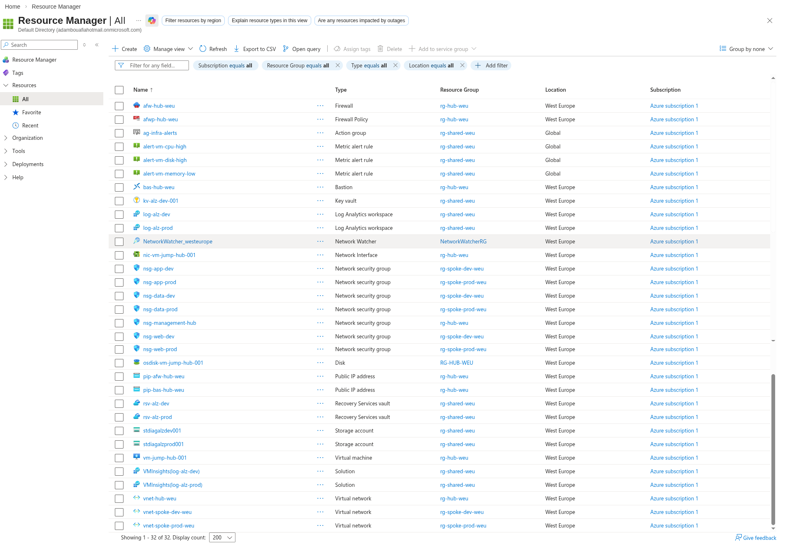

---

## Resource Groups

A **resource group** is a container that holds related Azure resources. Think of it like a folder
on a computer - it doesn't do anything by itself, but it organizes everything inside it so we can
manage, monitor, and delete resources as a unit.

Our landing zone uses four resource groups, each with a clear purpose:

| Resource Group | Purpose | Environment |
|----------------|---------|-------------|
| `rg-hub-weu` | Hub VNet, Firewall, Bastion, Jumpbox VM | Shared/Prod |
| `rg-shared-weu` | Key Vault, Log Analytics, Recovery Vault, Storage, Monitoring | Shared |
| `rg-spoke-dev-weu` | Dev spoke VNet and NSGs | Development |
| `rg-spoke-prod-weu` | Prod spoke VNet and NSGs | Production |
| `NetworkWatcherRG` | Auto-created by Azure for network diagnostics | System |

> **Why is there a `NetworkWatcherRG`?** Azure automatically provisions a Network Watcher
> resource in every region where we deploy VNets. It places this watcher in a resource group
> called `NetworkWatcherRG`. We did not create it - Azure did - but it shows up in the
> subscription, so it is documented here for completeness.

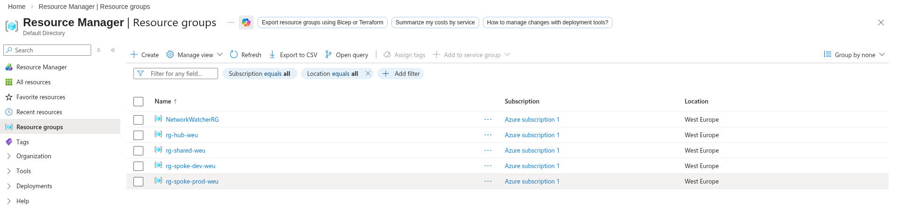

---

## Complete Resource List

The table below lists every resource deployed by our Bicep templates, sorted alphabetically.
The **Name** column follows our naming convention (`{prefix}-{workload}-{env}-{region}`), the
**Type** column shows the Azure resource type, and the **Resource Group** column shows which
container the resource lives in.

| Name | Type | Resource Group |
|------|------|----------------|
| `afw-hub-weu` | Firewall | `rg-hub-weu` |
| `afwp-hub-weu` | Firewall Policy | `rg-hub-weu` |
| `ag-infra-alerts` | Action group | `rg-shared-weu` |
| `alert-vm-cpu-high` | Metric alert rule | `rg-shared-weu` |
| `alert-vm-disk-high` | Metric alert rule | `rg-shared-weu` |
| `alert-vm-memory-low` | Metric alert rule | `rg-shared-weu` |
| `bas-hub-weu` | Bastion | `rg-hub-weu` |
| `kv-alz-dev-001` | Key vault | `rg-shared-weu` |
| `log-alz-dev` | Log Analytics workspace | `rg-shared-weu` |
| `log-alz-prod` | Log Analytics workspace | `rg-shared-weu` |
| `NetworkWatcher_westeurope` | Network Watcher | `NetworkWatcherRG` |
| `nic-vm-jump-hub-001` | Network Interface | `rg-hub-weu` |
| `nsg-app-dev` | Network security group | `rg-spoke-dev-weu` |
| `nsg-app-prod` | Network security group | `rg-spoke-prod-weu` |
| `nsg-data-dev` | Network security group | `rg-spoke-dev-weu` |
| `nsg-data-prod` | Network security group | `rg-spoke-prod-weu` |
| `nsg-management-hub` | Network security group | `rg-hub-weu` |
| `nsg-web-dev` | Network security group | `rg-spoke-dev-weu` |
| `nsg-web-prod` | Network security group | `rg-spoke-prod-weu` |
| `osdisk-vm-jump-hub-001` | Disk | `rg-hub-weu` |
| `pip-afw-hub-weu` | Public IP address | `rg-hub-weu` |
| `pip-bas-hub-weu` | Public IP address | `rg-hub-weu` |
| `rsv-alz-dev` | Recovery Services vault | `rg-shared-weu` |
| `rsv-alz-prod` | Recovery Services vault | `rg-shared-weu` |
| `stdiagalzdev001` | Storage account | `rg-shared-weu` |
| `stdiagalzprod001` | Storage account | `rg-shared-weu` |
| `vm-jump-hub-001` | Virtual machine | `rg-hub-weu` |
| `VMInsights(log-alz-dev)` | Solution | `rg-shared-weu` |
| `VMInsights(log-alz-prod)` | Solution | `rg-shared-weu` |
| `vnet-hub-weu` | Virtual network | `rg-hub-weu` |
| `vnet-spoke-dev-weu` | Virtual network | `rg-spoke-dev-weu` |
| `vnet-spoke-prod-weu` | Virtual network | `rg-spoke-prod-weu` |

That is **32 resources** in total. Notice how every name makes its purpose obvious - we can tell
at a glance that `afw-hub-weu` is the Azure Firewall in the hub, deployed to West Europe, and
`nsg-web-prod` is the Network Security Group protecting the web subnet in production.

---

## Hub VNet Details

The hub VNet (`vnet-hub-weu`) is the central point of the entire network. All traffic between
spokes flows through it, and it hosts the shared networking services - Firewall, Bastion, and
the management jumpbox.

### Subnets

A subnet is a smaller network carved out of the VNet's address space. Each subnet serves a
specific purpose and has its own security rules. Here is what the hub contains:

| Subnet | Address Prefix | Connected Device |
|--------|----------------|------------------|
| `AzureFirewallSubnet` | `10.0.1.0/26` | `afw-hub-weu` (Firewall, IP: `10.0.1.4`) |
| `AzureBastionSubnet` | `10.0.2.0/26` | `bas-hub-weu` (Bastion) |
| `snet-management` | `10.0.3.0/24` | `nic-vm-jump-hub-001` (IP: `10.0.3.4`) |
| `GatewaySubnet` | `10.0.4.0/27` | Reserved for future VPN/ExpressRoute |

> **Why the small /26 and /27 ranges?** Azure Firewall and Bastion each need a dedicated subnet
> but don't consume many IPs. A `/26` gives 64 addresses, which is more than enough. The
> `GatewaySubnet` uses `/27` (32 addresses) because Azure VPN Gateway requires at least that
> size. We keep these subnets small to preserve address space for workloads.

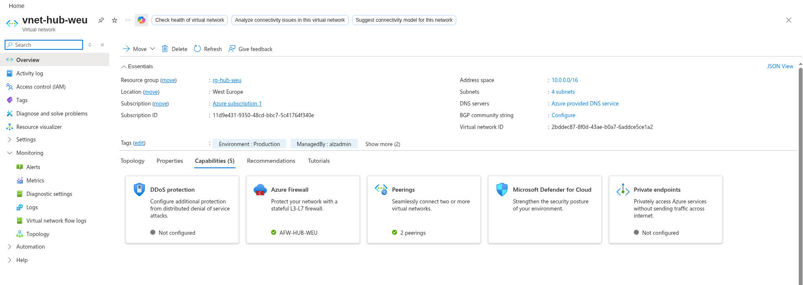

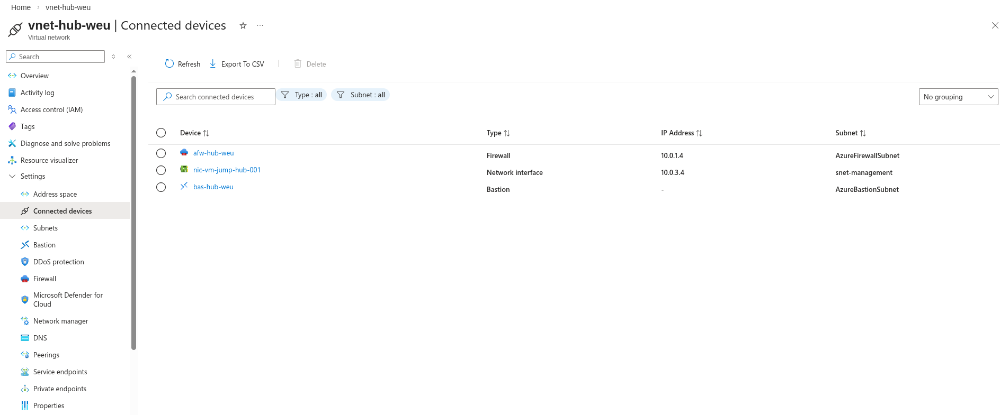

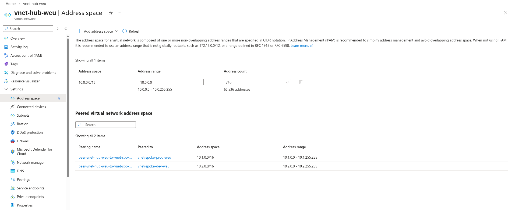

### Peerings

**VNet peering** connects two VNets so resources in each can communicate directly over Azure's
backbone network (no public internet involved). The hub is peered with both spokes:

| Peering Name | Remote VNet | Address Space | State |
|--------------|-------------|---------------|-------|
| `peer-vnet-hub-weu-to-vnet-spoke-prod-weu` | `vnet-spoke-prod-weu` | `10.1.0.0/16` | Connected, Fully Synchronized |
| `peer-vnet-hub-weu-to-vnet-spoke-dev-weu` | `vnet-spoke-dev-weu` | `10.2.0.0/16` | Connected, Fully Synchronized |

The state **Connected, Fully Synchronized** means both sides of the peering are active and
routing tables have been exchanged. If this ever shows `Disconnected`, traffic between the
hub and that spoke will stop flowing.

> **Important:** The spokes are never peered directly to each other. All inter-spoke traffic
> goes through the hub's Azure Firewall. This is by design - it gives us a single inspection
> point for all east-west traffic.

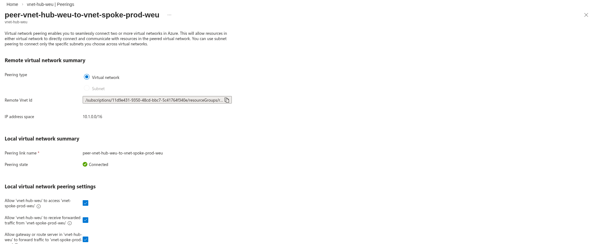

---

## Key Resources Detail

### Azure Firewall

The **Azure Firewall** (`afw-hub-weu`) is the central security appliance in the hub-spoke
topology. All traffic between spokes and all outbound internet traffic passes through it,
giving us a single point to inspect, log, and filter network traffic.

- **SKU:** Standard
- **Private IP:** `10.0.1.4`
- **Public IP:** `pip-afw-hub-weu`
- **Policy:** `afwp-hub-weu`

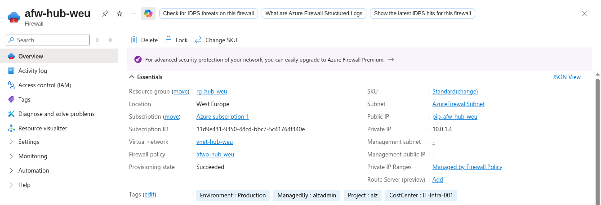

### Firewall Policy

The **Firewall Policy** (`afwp-hub-weu`) defines what traffic the firewall allows or denies.
Rather than configuring rules directly on the firewall, Azure uses a separate policy resource.
This makes it easy to share one policy across multiple firewalls if the environment grows.

- **Network rules:** 3 rules (controlling traffic between subnets)
- **Application rules:** 2 rules (controlling outbound internet access by FQDN)
- **Threat intelligence mode:** Alert (logs suspicious traffic but does not block it)

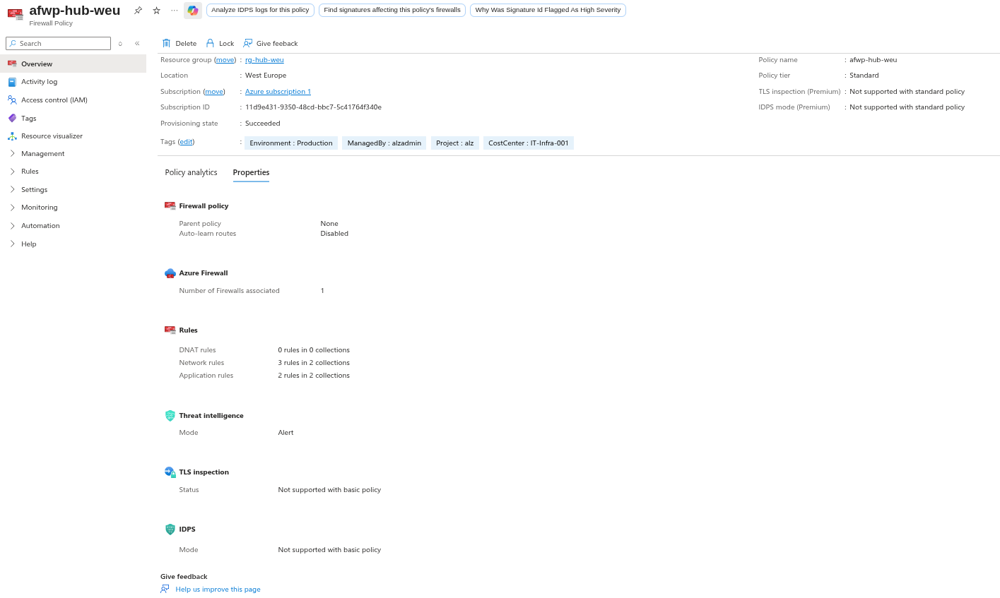

### Azure Bastion

**Azure Bastion** (`bas-hub-weu`) provides secure RDP and SSH access to virtual machines
without exposing them to the public internet. Instead of connecting to a public IP on the VM,
we connect through the Azure portal, and Bastion brokers the session over TLS.

- **Tier:** Basic
- **Subnet:** `AzureBastionSubnet` (`10.0.2.0/26`)
- **Public IP:** `pip-bas-hub-weu`

This is why the jumpbox VM has no public IP - Bastion handles all remote access.

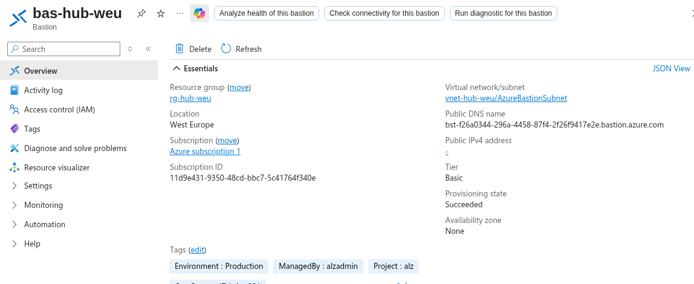

### Jumpbox VM

The **Jumpbox** (`vm-jump-hub-001`) is a management virtual machine in the hub's management
subnet. Administrators connect to it through Bastion, and from there they can reach resources
in any spoke. It is the only VM in the entire landing zone.

- **Size:** Standard B2s v2 (2 vCPUs, 4 GB RAM - sufficient for management tasks)
- **OS:** Windows Server 2022
- **Private IP:** `10.0.3.4`
- **NIC:** `nic-vm-jump-hub-001`
- **OS Disk:** `osdisk-vm-jump-hub-001`
- **NSG:** `nsg-management-hub` (allows only RDP and SSH from the Bastion subnet)

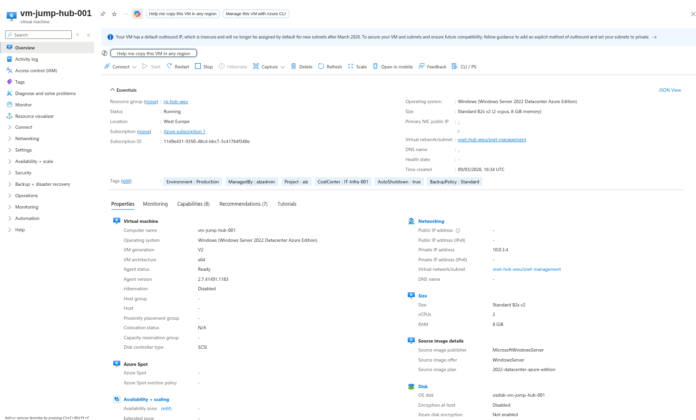

### Key Vault

**Azure Key Vault** (`kv-alz-dev-001`) stores secrets, certificates, and encryption keys. In
this landing zone it holds the jumpbox admin password and any other sensitive values that should
not be stored in plain text.

- **Access model:** RBAC (Role-Based Access Control, the modern approach - not the legacy access
  policies)
- **Soft delete:** Enabled (deleted secrets are recoverable for 90 days)
- **Purge protection:** Enabled (prevents permanent deletion even by admins)

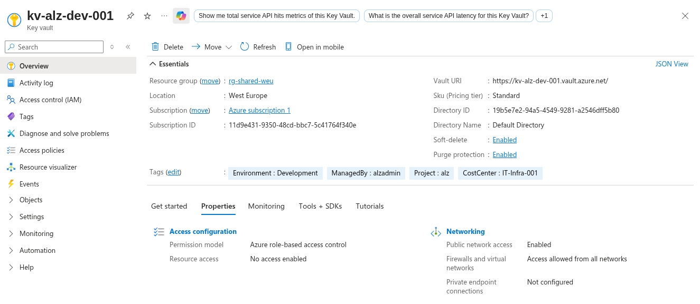

### Log Analytics Workspaces

**Log Analytics** is where all diagnostic logs, metrics, and security events are collected. We
deploy two workspaces to keep dev and prod telemetry separate:

- `log-alz-dev` - collects logs from development resources
- `log-alz-prod` - collects logs from production resources

Both use the **Pay-as-we-go** pricing tier, which means we only pay for the data ingested.
The **VMInsights** solutions (`VMInsights(log-alz-dev)` and `VMInsights(log-alz-prod)`) are
automatically added to enable performance monitoring and dependency mapping for VMs.

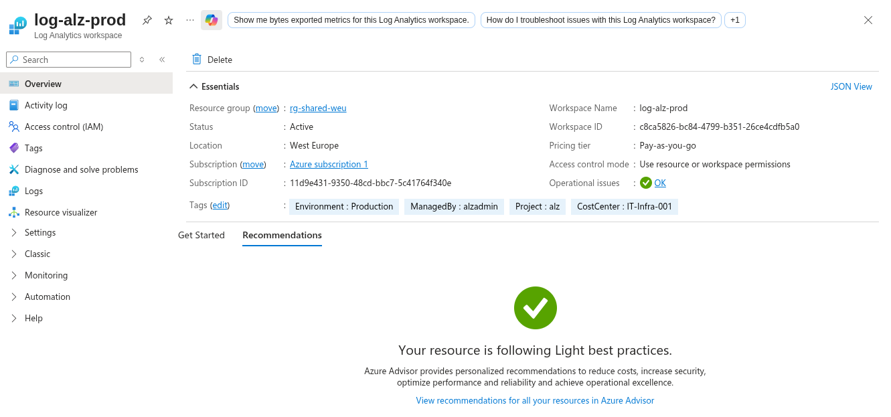

### Recovery Services Vaults

**Recovery Services Vaults** provide backup and disaster recovery for Azure resources. Like
Log Analytics, we deploy one per environment:

- `rsv-alz-dev` - backup vault for development resources
- `rsv-alz-prod` - backup vault for production resources

These vaults are pre-provisioned and ready to protect VMs, databases, and file shares as
workloads are added to the spokes.

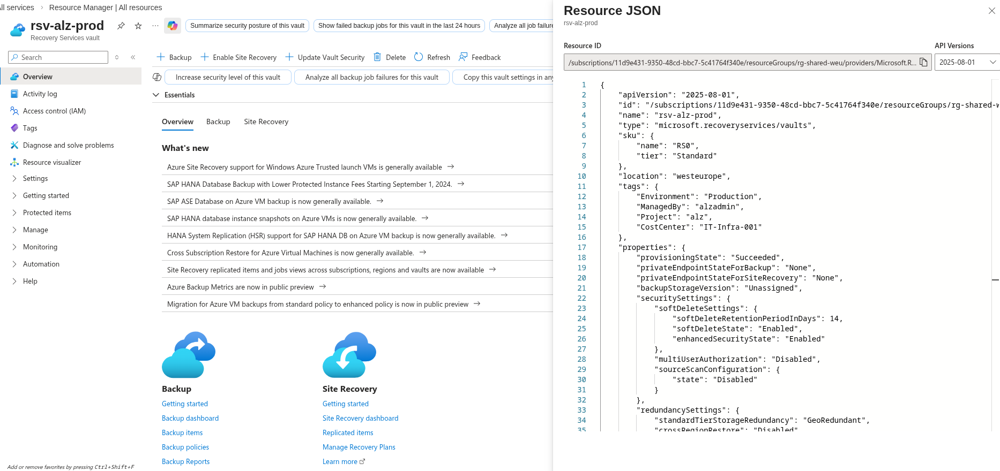

---

## NSG Audit Results

**Network Security Groups** (NSGs) are the subnet-level firewalls that control which traffic is
allowed into and out of each subnet. Our landing zone deploys 7 NSGs in total.

The automated NSG audit script (`scripts/powershell/Invoke-NsgAudit.ps1`) scanned all NSGs and
produced the following summary:

- **7 NSGs** deployed across 3 resource groups
- **17 custom rules** (rules we defined in our Bicep templates)
- **42 default rules** (rules Azure adds automatically to every NSG)
- **No rules allowing `Any` source** - every custom allow rule restricts the source to a
  specific subnet range

This is a key compliance finding. Allowing `Any` as a source address is a common misconfiguration
that exposes resources to the entire internet. Our NSG rules are properly scoped - for example,
the web subnet NSGs only allow HTTP/HTTPS traffic from the Firewall subnet (`10.0.1.0/26`), and
the data subnet NSGs only allow SQL traffic from the app subnet.

The full audit output is saved to `nsg-audit.csv` in the project root.

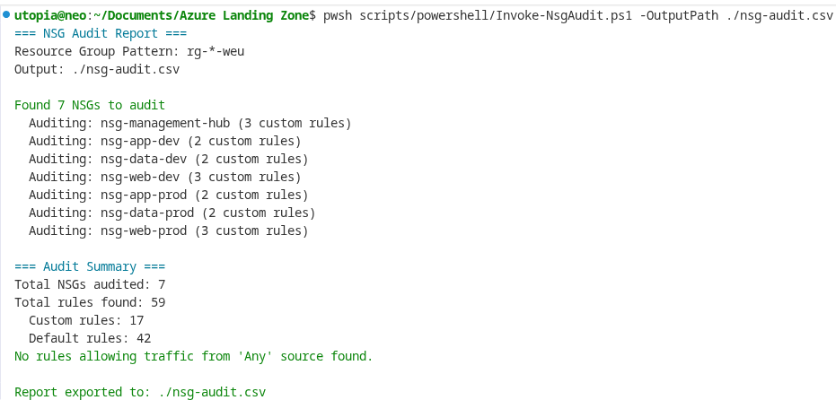
